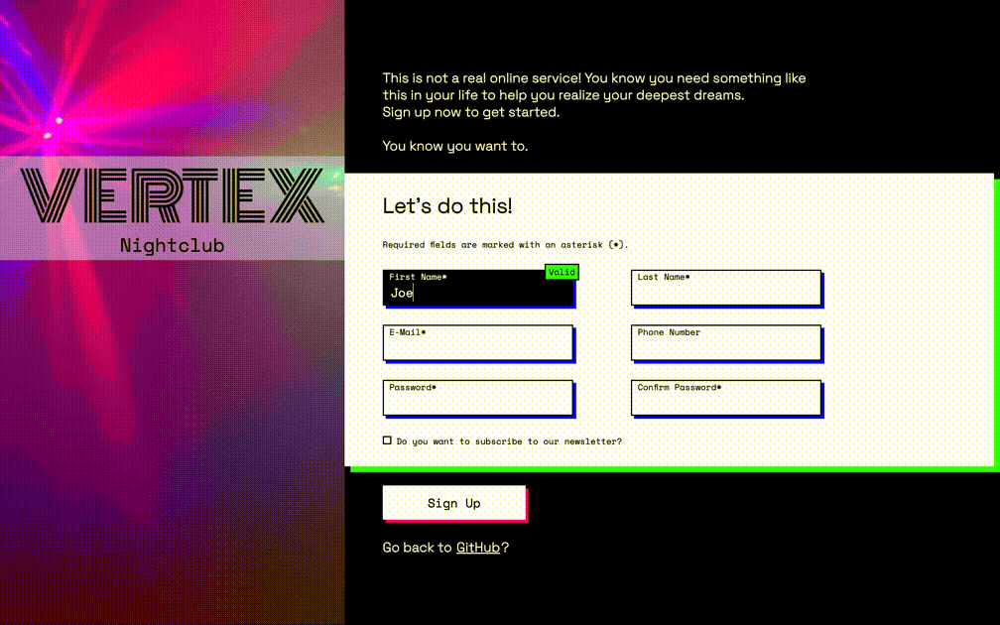

# My “Sign-up Form” Project
 

## Description
In this project from “The Odin Project” I create a Sign-up Form with a brutalist design.  
This Sign-up Form has:
- individual validation for each input and
- a password strength meter.

## Links
- [Live Preview](https://tomsoerr.github.io/odin-sign-up-form/)
- Link to the [Assignment](https://www.theodinproject.com/lessons/node-path-intermediate-html-and-css-sign-up-form)
- See my next [Project](https://github.com/TomSoerr/odin-admin-dashboard)
